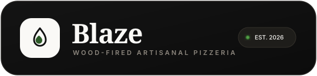

<p align="center">
  <a href="https://github.com/Fuhad-adeyanju09/Blaze">
    
  </a>
</p>

<p align="center">
  <strong>An editorial, wood-fired artisanal pizza ordering platform built with modern web technologies.</strong>
  <br />
  <em>Crafted with React 19, TypeScript, Node.js, Express, MongoDB Atlas, Socket.io, and Framer Motion.</em>
</p>

<p align="center">
  
  
  
  
  
  
  
  
  
</p>

---

## 📖 Table of Contents

- [Overview & Design Philosophy](#-overview--design-philosophy)
- [Key Features](#-key-features)
- [System Architecture & Tech Stack](#-system-architecture--tech-stack)
- [Editorial Micro-Interactions](#-editorial-micro-interactions)
- [Interactive Pizza Builder](#-interactive-pizza-builder)
- [Real-Time Order Tracking Pipeline](#-real-time-order-tracking-pipeline)
- [Admin Operations & Inventory Management](#-admin-operations--inventory-management)
- [Project Directory Structure](#-project-directory-structure)
- [Getting Started Locally](#-getting-started-locally)
- [Environment Variables](#-environment-variables)
- [Database Seeding & Test Credentials](#-database-seeding--test-credentials)
- [REST API Reference](#-rest-api-reference)
- [Production Deployment Guide](#-production-deployment-guide)
- [Contributing & License](#-contributing--license)

---

## 🌿 Overview & Design Philosophy

**Blaze** is a full-stack e-commerce pizzeria platform engineered for speed, aesthetics, and reliability. Inspired by high-fashion editorial design systems (such as [Oriente](https://oriente-nu.vercel.app/)), Blaze breaks away from traditional saturated, cartoonish fast-food themes in favor of an understated, artisanal aesthetic:

- **Warm Cream Canvas (`#faf9f6`)**: Organic, warm, and inviting backdrop that eliminates stark digital whites.
- **Deep Editorial Charcoal (`#111111`)**: High-contrast near-black typography and primary pill actions.
- **Muted Olive Green (`#2d5a27`)**: Sophisticated culinary accents for bag additions, indicators, and success states.
- **Warm Light Borders (`#e8e4dd`)**: Delicate 1px structural dividers framing cards and sections.
- **Serif Typography (`Playfair Display`)**: Elegant display headings paired with clean, readable sans-serif body copy (`Inter`) and authentic handwritten scripts (`Caveat`).

---

## 🍕 Key Features

### 🌟 Customer Experience
- **Dynamic Auto-Rotating Hero Showcase**:
  - Auto-rotates between 5 high-resolution artisanal pizzas every 4.5 seconds.
  - Smooth Framer Motion `AnimatePresence` cross-fade transitions (`scale: 1.08 → 1.0 → 0.96`).
  - Pause-on-hover capability allowing customers to inspect toppings and details.
  - Retained scroll parallax depth with subtle tilt.
  - Category badges with pulsing status lights and interactive slide jump bars.
- **"OUR MENU" Living Text-Clip Section**:
  - Full-width bold display typography clipping 7 distinct artisanal pizza photographs inside each letter (`O`, `U`, `R`, `M`, `E`, `N`, `U`).
  - Continuous CSS keyframe animation panning images seamlessly behind text.
  - Slanted handwritten script overlay (*"Fuel for the Pizza Grind"*) in Caveat 700.
  - Responsive font clamp ensuring zero overflow on mobile screens.
- **Oriente Kinetic Marquees**:
  - 3-row layered kinetic text tickers running in alternating directions.
  - Interactive hover deceleration crawl allowing customers to read marquee phrases.
- **Custom Artisanal Pizza Builder**:
  - 4-phase customization flow: **Crust Base → House Sauce → Artisanal Cheese → Fresh Farm Vegetables**.
  - Dynamic real-time price calculation updating as toppings are added or removed.
  - Visual layer stacking and instant "Add Custom to Bag" workflow.
- **Sliding Cart Drawer & Checkout**:
  - Right-hand slide-out cart drawer with item quantity modifiers and real-time subtotal tracking.
  - Razorpay checkout integration supporting test simulation and HMAC-SHA256 signature verification.
- **Socket.io Real-Time Order Tracking**:
  - Live progress pipeline tracking 4 stages: `Order Placed` ➔ `In Kitchen` ➔ `Out for Delivery` ➔ `Delivered`.
  - Duplex Socket.io events notifying the client instantly when kitchen staff updates status.

### 🛡️ Admin & Operational Controls
- **Live Kitchen Order Board**:
  - Real-time order pipeline with inline status transition controls.
  - Filter orders by status and view complete breakdown of customized ingredients.
- **Automated Inventory & Threshold Monitoring**:
  - Live stock ledger with threshold limits for cheeses, sauces, bases, and vegetables.
  - Inline stock level adjustments with immediate validation.
  - Automated daily 8:00 AM `node-cron` job scanning stock levels and dispatching consolidated low-stock alert emails via Nodemailer.
- **Menu Catalog Manager**:
  - Create, update, or archive signature pizzas and builder ingredients.
  - Cloudinary asset management with graceful local buffer fallbacks.

---

## 🏗️ System Architecture & Tech Stack

```
                               ┌────────────────────────┐
                               │   React 19 + Vite UI   │
                               │  Tailwind + Framer     │
                               └───────────┬────────────┘
                                           │
                        HTTP REST API      │      Socket.io Duplex
                        (Axios / JSON)     │      (Real-time status)
                                           ▼
                               ┌────────────────────────┐
                               │  Express 4.19 Backend  │
                               │  (Node.js 18+ / TS)    │
                               └───────────┬────────────┘
                                           │
             ┌─────────────────────────────┼─────────────────────────────┐
             ▼                             ▼                             ▼
   ┌───────────────────┐         ┌───────────────────┐         ┌───────────────────┐
   │   MongoDB Atlas   │         │     Razorpay      │         │     Nodemailer    │
   │  Mongoose ODM +   │         │ Payment Gateway + │         │ Email Dispatch +  │
   │ Memory Fallback   │         │ HMAC Verification │         │ Daily Cron Scans  │
   └───────────────────┘         └───────────────────┘         └───────────────────┘
```

### Frontend Stack
| Layer | Technology | Description |
| :--- | :--- | :--- |
| **Framework** | [React 19](https://react.dev/) | High-performance component architecture |
| **Bundler** | [Vite 6](https://vitejs.dev/) | Ultra-fast HMR and optimized production bundling |
| **Language** | [TypeScript 5.8](https://www.typescriptlang.org/) | Strict type safety across components and models |
| **Styling** | [Tailwind CSS 3.4](https://tailwindcss.com/) | Utility-first styling configured with custom tokens |
| **Animations** | [Framer Motion 11](https://www.framer.com/motion/) | Parallax, magnetic buttons, scramble text, page transitions |
| **Icons** | [Lucide React](https://lucide.dev/) | Clean, consistent SVG icon set |
| **State & HTTP** | [Axios](https://axios-http.com/) | Configured API instance with JWT interceptors |
| **WebSockets** | [Socket.io Client](https://socket.io/) | Real-time bi-directional order status updates |

### Backend Stack
| Layer | Technology | Description |
| :--- | :--- | :--- |
| **Runtime** | [Node.js 18+](https://nodejs.org/) | Server runtime environment |
| **Server** | [Express 4.19](https://expressjs.com/) | Modular REST API routing and middleware |
| **Database** | [MongoDB Atlas](https://www.mongodb.com/atlas) | Cloud document database with Mongoose ODM |
| **Fallback DB**| [mongodb-memory-server](https://github.com/nodkz/mongodb-memory-server) | Zero-setup in-memory database fallback |
| **Security** | [JWT](https://jwt.io/) & [Bcrypt.js](https://github.com/dcodeIO/bcrypt.js) | Stateless auth with token rotation & password salting |
| **Payments** | [Razorpay SDK](https://razorpay.com/) | Payment order generation & HMAC verification |
| **Scheduler**| [node-cron](https://github.com/node-cron/node-cron) | Scheduled daily 8:00 AM inventory stock checks |
| **Mailer** | [Nodemailer](https://nodemailer.com/) | SMTP email notifications & password reset tokens |

---

## 💫 Editorial Micro-Interactions

Blaze implements 5 tactile micro-interactions that elevate the digital dining experience:

1. **Magnetic Buttons** (`<Magnetic>`): Primary buttons physically drift towards the user's cursor within a defined proximity field, providing tangible feedback.
2. **Text Scramble on Hover** (`<TextScramble>`): Alphanumeric glyphs randomly cycle through cryptographic characters before cleanly resolving to the target word.
3. **Smooth Custom Cursor** (`<CustomCursor>`): Minimal lag-follower ring that expands when hovering over clickable elements.
4. **Scroll Parallax** (`<ParallaxImage>`): Imagery floats at variable scroll speeds with subtle 3D rotational tilt.
5. **Dynamic Animated Counters** (`<AnimatedCounter>`): Statistics and brand metrics count up smoothly from `0` when scrolled into view.

---

## 🍕 Interactive Pizza Builder

The custom builder operates across 4 sequential stages with real-time base price compounding:

```
[ Step 1: Base Crust ] ──────► [ Step 2: Sauce ] ──────► [ Step 3: Cheese ] ──────► [ Step 4: Veggies ]
  • Classic Wood-Fired           • San Marzano Tomato      • Fior di Latte Mozzarella • Roasted Bell Peppers
  • Thin Crisp Crust             • Creamy Truffle Garlic   • Smoked Provolone         • Sliced Mushrooms
  • Artisan Sourdough            • Spicy Arrabbiata        • Aged Gorgonzola          • Kalamata Olives
  • Gluten-Free Herb             • Basil Pesto Genovese    • Vegan Cashew Cream       • Caramelized Onions
```

- Each selection validates against current inventory thresholds.
- The sidebar displays live itemized pricing with automatic tax and preparation time estimates.

---

## ⚡ Real-Time Order Tracking Pipeline

```
  [1. Order Placed] ────────► [2. In Kitchen] ────────► [3. Out for Delivery] ────────► [4. Delivered]
    Customer checkout           Wood-fired oven prep          Driver en route              Confirmed drop-off
    via Razorpay / COD          Live kitchen update           Live courier push            Order completed
```

- When an admin changes the status in `/admin/orders`, a `status_updated` socket event is broadcast to the customer's room.
- The tracking view reflects the update in under 50ms without page reloads.

---

## 📊 Admin Operations & Inventory Management

The administrative portal (`/admin`) provides full visibility over restaurant operations:

- **Metric Dashboard**: Real-time KPI counters tracking gross revenue, pending orders, completed deliveries, and low-stock alerts.
- **Order Command Center**: Real-time pipeline with single-click order progression and full customer receipt breakdown.
- **Inventory Ledger**: Real-time tracking of base crusts, sauces, cheeses, and toppings with minimum stock thresholds.
- **Stock Alert Engine**: Automatic low-stock notifications dispatched via email when ingredients dip below safety thresholds.

---

## 📂 Project Directory Structure

```text
Blaze/
├── assets/
│   └── logo.svg                 # High-res vector brand logo for README & docs
├── client/                      # React 19 Frontend Application
│   ├── public/
│   │   ├── favicon.svg          # Minimalist brand favicon
│   │   └── logo.svg             # Vector logo asset
│   ├── src/
│   │   ├── components/
│   │   │   ├── auth/            # Protected route & role guards
│   │   │   ├── home/            # MenuHero, HeroPizzaShowcase, Lookbook
│   │   │   ├── layout/          # Navbar, Footer, AnnouncementBar
│   │   │   └── ui/              # PizzaCard, Magnetic, Scramble, CartDrawer
│   │   ├── context/             # AuthContext, CartContext, SocketContext
│   │   ├── hooks/               # useScroll, useParallax, useMagnetic
│   │   ├── lib/                 # Axios api client instance
│   │   ├── pages/
│   │   │   ├── Admin/           # Dashboard, Orders, Inventory, Menu Manager
│   │   │   ├── Auth/            # Login, Register, Forgot Password, Verify
│   │   │   ├── Home.tsx         # Editorial landing page
│   │   │   ├── Menu.tsx         # Catalog filter & search
│   │   │   ├── Build.tsx        # 4-stage interactive builder
│   │   │   ├── Cart.tsx         # Cart summary & payment trigger
│   │   │   └── Orders.tsx       # Live status tracking pipeline
│   │   ├── index.css            # Custom CSS variables, marquee, font imports
│   │   └── main.tsx             # React entry point
│   ├── index.html
│   ├── tailwind.config.js       # Custom colors, fonts, animations
│   ├── tsconfig.json
│   └── vite.config.ts
├── server/                      # Node.js + Express Backend API
│   ├── config/
│   │   ├── db.ts                # MongoDB Atlas connection & retry logic
│   │   └── cloudinary.ts        # Cloudinary image storage config
│   ├── controllers/             # Auth, Pizza, Order, Inventory controllers
│   ├── middleware/              # JWT auth verification, admin role guard
│   ├── models/                  # Mongoose schemas (User, Pizza, Order, Inventory)
│   ├── routes/                  # API route endpoints
│   ├── services/                # Nodemailer email & cron service
│   ├── seed.js                  # Database seed script with validation
│   ├── package.json
│   └── server.ts                # Express setup, Socket.io initialization
├── .gitignore
├── package.json                 # Monorepo root scripts (dev, build, seed)
└── README.md
```

---

## 🚀 Getting Started Locally

### 1. Prerequisites
- **Node.js** (v18.0 or higher)
- **npm** (v9.0 or higher)
- **MongoDB Atlas** account (or local MongoDB instance) — *an embedded in-memory database will spin up automatically if no URI is provided*.

### 2. Installation
Clone the repository and install all dependencies:

```bash
git clone https://github.com/Fuhad-adeyanju09/Blaze.git
cd Blaze

# Install root dependencies
npm install

# Install both client and server dependencies
npm run install:all
```

### 3. Configure Environment Variables
Create `.env` files for both server and client:

```bash
# Server configuration
cp server/.env.example server/.env

# Client configuration
cp client/.env.example client/.env
```
*(See the [Environment Variables](#-environment-variables) section below for required keys)*.

### 4. Seed Database
Populate your database with signature pizzas, builder ingredients, inventory thresholds, and an admin user:

```bash
npm run seed
```

### 5. Launch Development Servers
Run both backend (`http://localhost:5000`) and frontend (`http://localhost:5173`) concurrently:

```bash
npm run dev
```

---

## 🔑 Environment Variables

### Backend Configuration (`server/.env`)
```ini
PORT=5000
NODE_ENV=development

# Database Connection (MongoDB Atlas)
MONGODB_URI=mongodb+srv://<username>:<password>@<cluster>.mongodb.net/blaze?retryWrites=true&w=majority

# JWT Authentication
JWT_SECRET=your_super_secret_jwt_key_at_least_32_characters
JWT_REFRESH_SECRET=your_super_secret_refresh_key_at_least_32_characters
JWT_EXPIRES_IN=1h
JWT_REFRESH_EXPIRES_IN=7d

# Razorpay Payments (Test Sandbox)
RAZORPAY_KEY_ID=rzp_test_your_key_id
RAZORPAY_KEY_SECRET=your_razorpay_secret

# Email Alerts (Gmail SMTP)
GMAIL_USER=your_email@gmail.com
GMAIL_APP_PASSWORD=your_16_digit_app_password
ADMIN_EMAIL=admin@blaze.com

# Client Origin
CLIENT_URL=http://localhost:5173
```

### Frontend Configuration (`client/.env`)
```ini
VITE_API_URL=http://localhost:5000
VITE_SOCKET_URL=http://localhost:5000
VITE_RAZORPAY_KEY_ID=rzp_test_your_key_id
```

---

## 🧪 Database Seeding & Test Credentials

The database seeder automatically initializes the platform with full catalogs and mock data:

```bash
npm run seed
```

| Account Role | Email Address | Password | Permissions |
| :--- | :--- | :--- | :--- |
| **Administrator** | `admin@blaze.com` | `Admin@blaze123` | Full access to `/admin` dashboard, orders, inventory, and menu |
| **Demo Customer** | `alex@blaze.com` | `User@blaze123` | Standard customer ordering & tracking access |

### 💳 Sandbox Payment Card
- **Card Number**: `4111 1111 1111 1111`
- **Expiry Date**: Any future MM/YY (e.g. `12/28`)
- **CVV**: Any 3-digit code (e.g. `123`)
- **OTP**: `123456` or click "Success" in the test dialog

---

## 📡 REST API Reference

### Health Check
| Method | Endpoint | Description |
| :--- | :--- | :--- |
| `GET` | `/api/health` | Check backend & MongoDB Atlas connectivity |

### Authentication (`/api/auth`)
| Method | Endpoint | Auth | Description |
| :--- | :--- | :--- | :--- |
| `POST` | `/api/auth/register` | Public | Register new customer account |
| `POST` | `/api/auth/login` | Public | Login with email & password |
| `POST` | `/api/auth/refresh` | Public | Refresh JWT access token |
| `POST` | `/api/auth/logout` | User | Invalidate current session |
| `POST` | `/api/auth/forgot-password` | Public | Send password reset email |
| `POST` | `/api/auth/reset-password/:token` | Public | Reset password with token |
| `GET` | `/api/auth/verify-email/:token` | Public | Verify customer email address |

### Pizza Catalog & Builder (`/api/pizza`)
| Method | Endpoint | Auth | Description |
| :--- | :--- | :--- | :--- |
| `GET` | `/api/pizza` | Public | Get all signature pizzas |
| `GET` | `/api/pizza/options` | Public | Get builder options (bases, sauces, cheeses, veggies) |
| `POST` | `/api/pizza` | Admin | Create a new signature pizza |
| `PUT` | `/api/pizza/:id` | Admin | Update signature pizza details |
| `DELETE` | `/api/pizza/:id` | Admin | Delete a signature pizza |

### Orders & Checkout (`/api/orders`)
| Method | Endpoint | Auth | Description |
| :--- | :--- | :--- | :--- |
| `POST` | `/api/orders` | User | Create a new order |
| `POST` | `/api/orders/razorpay/create` | User | Generate Razorpay order ID |
| `POST` | `/api/orders/razorpay/verify` | User | Verify HMAC payment signature |
| `GET` | `/api/orders/my-orders` | User | Get order history for current user |
| `GET` | `/api/orders/:id` | User | Get detailed order status and tracking |
| `GET` | `/api/orders` | Admin | Fetch all orders across the restaurant |
| `PATCH`| `/api/orders/:id/status` | Admin | Update kitchen stage (`In Kitchen`, etc.) |

### Inventory (`/api/inventory`)
| Method | Endpoint | Auth | Description |
| :--- | :--- | :--- | :--- |
| `GET` | `/api/inventory` | Admin | Get all inventory stock levels & thresholds |
| `PATCH`| `/api/inventory/:id` | Admin | Update stock quantity or threshold limit |

---

## 🚢 Production Deployment Guide

### Deploying Backend to Render
1. Create a **New Web Service** on [Render](https://render.com/).
2. Link your GitHub repository (`https://github.com/Fuhad-adeyanju09/Blaze`).
3. Set the configuration:
   - **Root Directory**: `server`
   - **Build Command**: `npm install`
   - **Start Command**: `npm start`
4. Add all environment variables from [`server/.env`](#backend-configuration-serverenv).
5. Deploy and note your live URL (e.g. `https://blaze-server.onrender.com`).
6. Test your live connection via `https://blaze-server.onrender.com/api/health`.

### Deploying Frontend to Vercel
1. Create a **New Project** on [Vercel](https://vercel.com/).
2. Select your `Blaze` repository.
3. Configure settings:
   - **Framework Preset**: `Vite`
   - **Root Directory**: `client`
   - **Build Command**: `npm run build`
   - **Output Directory**: `dist`
4. Add frontend environment variables:
   - `VITE_API_URL=https://blaze-server.onrender.com`
   - `VITE_SOCKET_URL=https://blaze-server.onrender.com`
   - `VITE_RAZORPAY_KEY_ID=your_razorpay_key_id`
5. Click **Deploy**.

---

## 🤝 Contributing & License

Contributions, issues, and feature requests are welcome!

1. Fork the repository
2. Create your feature branch (`git checkout -b feature/editorial-upgrade`)
3. Commit your changes (`git commit -m 'feat: add artisanal wood-fired special'`)
4. Push to the branch (`git push origin feature/editorial-upgrade`)
5. Open a Pull Request

Distributed under the **MIT License**. See `LICENSE` for more information.

<p align="center">
  Crafted with passion by <a href="https://github.com/Fuhad-adeyanju09"><strong>Fuhad Adeyanju</strong></a> · <strong>Blaze Pizzeria</strong>
</p>
